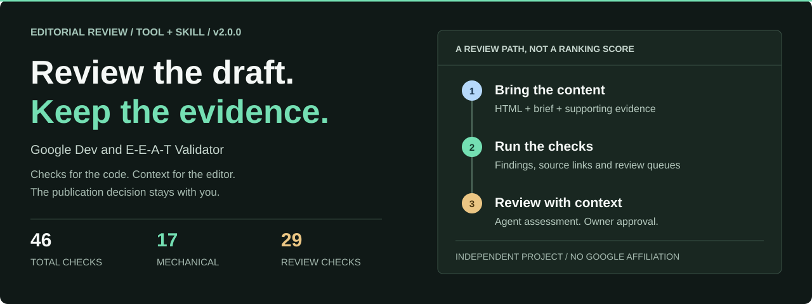

# Google-Dev-and-EEAT-Validator

[](https://github.com/andersonkevin/Google-Dev-and-EEAT-Validator/actions/workflows/tests.yml)



**An evidence-led review CLI for the work between a first draft and publication.**

Bring an HTML article or landing page, its brief and supporting evidence. Get
structured findings, source references and a focused queue for editorial review.
The checks are informed by Google Search Central, developer writing guidance
and E-E-A-T. Your operating AI agent evaluates the copy; the CLI checks structure,
evidence references and decision integrity. A person retains publication approval.

**v2.0.0** | **Python 3.10+** | **Tool + agent skill** | **MIT**

[Quick start](#quick-start) / [Review workflow](#review-workflow) /
[E-E-A-T coverage](#e-e-a-t-with-evidence) / [Documentation](#documentation)

> **Independent and unofficial.** Not affiliated with, endorsed by, or certified
> by Google. This is a review tool, not a ranking algorithm or an E-E-A-T score.

## Built for Editorial Review

| Check the draft | Keep the evidence | Make the decision |
| --- | --- | --- |
| 17 mechanical checks cover supported HTML, metadata and input-integrity conditions. | Findings retain source links; receipts bind to the current input fingerprint. | 29 contextual, rendered or live-evidence checks record assessment without granting publication approval. |

Use it for **articles and landing pages**, with stage-aware checks for **draft,
staging and live** content. It runs locally: no API key, model, account or network
connection is required by the CLI. No content is uploaded or published by the CLI.
The operating agent uses its existing model and tools, with their own privacy settings.

## Use It with Your Agent

Open the complete checkout in a file-capable assistant and point it to
[the review skill](skills/google-dev-eeat-review/SKILL.md):

> Use the google-dev-eeat-review skill to assess this draft and its evidence.
> Evaluate each applicable criterion, record sources and actor provenance, and
> return findings without publishing.

The **skill** guides research and judgment. The **tool** checks the inputs and
decisions. The **report** is the artifact. No hosted agent runtime, model API
integration or global installation is added.
[Operator walkthrough](docs/AGENT-REVIEW.md).

## Quick Start

Clone the repository, then run the included synthetic example. No package
installation is needed; Python 3.10+ is the only runtime requirement.

```sh
git clone https://github.com/andersonkevin/Google-Dev-and-EEAT-Validator.git
cd Google-Dev-and-EEAT-Validator
python3 -B tools/validate_draft.py examples/bundle.json --references-only
```

The example produces a JSON report. Selected fields from its output:

```json
{
  "validator_version": "2.0.0",
  "stage": "draft",
  "page_type": "article",
  "readiness": "review_required",
  "counts": {
    "needs_review": 18,
    "not_applicable": 21,
    "pass": 7
  },
  "source_verification": "references_only_not_verified",
  "source_review_required": true
}
```

**Exit code 2 is expected**, not a crash. The example has no fabricated editorial
approvals. This command does not write files or read any external workspace.

<details>
<summary><strong>Why does the example require review?</strong></summary>

`--references-only` uses linked rule references without a local source archive.
It explicitly reports `source_verification: references_only_not_verified`.
V2 accepts evidenced source-review attestations from the operating AI or human,
alongside rule and criterion decisions, to reach **ready_for_owner_review**.
This is not source authentication or permission to publish. Missing reviews remain
outstanding and supported failures still block.

For provenance-bound operation with a separately prepared, lawful local source
archive, use `--snapshot PATH` instead. See [the input contract](docs/CONTRACTS.md).
No archive, private source IDs, raw guides or automatic downloader is bundled.

</details>

## Review Workflow

```mermaid
flowchart LR
    A[HTML + brief + evidence] --> B[Mechanical checks]
    B --> C[Findings + review queue]
    C --> D[Agent editorial review]
    D --> E[Corrections + rerun]
    E --> F[Owner decision]
    style A fill:#e3effb,stroke:#5981a8,color:#173551
    style B fill:#def5e9,stroke:#4a8a6b,color:#183d2b
    style C fill:#e3effb,stroke:#5981a8,color:#173551
    style D fill:#fff1d6,stroke:#a27b36,color:#4b3712
    style E fill:#def5e9,stroke:#4a8a6b,color:#183d2b
    style F fill:#fff1d6,stroke:#a27b36,color:#4b3712
```



| Stage | What happens |
| --- | --- |
| Prepare | Define the reader, intent, page type and stage; attach the draft and evidence. |
| Validate | Inspect supported structural conditions and evidence-reference integrity. |
| Review | The operating agent assesses claims, usefulness, writing quality and source support; add actual rendered/live evidence where needed. |
| Recheck | Correct findings and rerun. Changed inputs invalidate stale review receipts. |
| Decide | The owner reviews the result. No state authorizes automatic publication. |

The agent records its model/run and whether it wrote the draft. A same-agent review
is disclosed, not presented as independent evaluation. Neither AI nor human review
receipts grant publication approval.
[See the complete workflow](docs/WORKFLOW.md).

## E-E-A-T with Evidence

The repository maps **20 contextual criteria** to rule references, evidence needs
and review questions. Each now requires a separate evidenced decision; related-rule
passes cannot fill it automatically. These are contextual gates, not 20 automatic
semantic checks or extra points on an E-E-A-T score.

| Review lens | Evidence to examine |
| --- | --- |
| Experience | First-hand demonstrations, methods and observations relevant to the claim. |
| Expertise | Topic-relevant knowledge, accurate explanations and appropriate review. |
| Authoritativeness | Independent reputation evidence and its relevance to the subject. |
| Trust | Attribution, factual support, ownership and transparent material relationships. |

Missing information is not the same as negative evidence. Attaching a file is not
proof that a claim is true. The map makes those distinctions visible to the editor.
[Explore the mapping and remaining gaps](docs/EEAT.md).

## Coverage and Boundaries

| Included | Requires more than this CLI |
| --- | --- |
| Supported HTML structure, link markup, alt presence and JSON syntax checks | Browser rendering, complete accessibility review and live link reachability |
| Metadata, canonical and declared indexing-intent checks where applicable | Indexing confirmation, rich-result eligibility and ranking outcomes |
| Claim-ledger references and evidence provenance fields | Factual verification, originality, expertise and independent reputation |
| Explicit failures, scope conflicts, actor provenance and stale-review rejection | Authenticated reviewers and final publication approval |
| Import of local browser/HTTP observation receipts | Collecting those observations in a browser or live environment |
| Independent-label evaluation and local source-coverage inspection | Completed independent calibration against real editorial decisions |

The tool does not write content, authenticate experts or publish to a CMS.
The source/rule mapping has not completed independent real-content calibration.

## Inputs And Results

Start with `examples/bundle.json`. Keep real work in a private directory outside
the repository. References to draft and evidence files are relative to that bundle.
The parser accepts HTML, not Markdown; use your existing renderer to prepare HTML.

| Exit | State | Meaning |
| --- | --- | --- |
| 0 | ready_for_owner_review | Applicable checks satisfied for the named stage; not permission to publish |
| 1 | invalid_input | Invalid input, path, schema or integrity |
| 2 | review_required | Outstanding review, missing verification or warning |
| 3 | blocked | Error or critical finding |

For a **new**, nonexistent output directory whose parent exists:

```sh
python3 -B tools/validate_draft.py examples/bundle.json --references-only --output review-output --execute
```

Use a private output location in real work. Exports contain `report.json`,
`report.txt` and `COMPLETE.json`. They may contain sensitive content. No overwrite
is permitted. An interrupted export without a valid completion receipt is incomplete.

## Tests

```sh
python3 -B -m unittest discover -s tests -v
```

Tests use temporary synthetic data. No source archive or external workspace is
required. GitHub Actions runs tests and distribution checks on pushes and pull
requests. The CLI has no telemetry or background job; CI fetches pinned GitHub
Actions and Python runtimes but installs no project dependencies.

```sh
python3 -B examples/review_walkthrough.py
python3 -B tools/release.py
```

The walkthrough is synthetic, not a model benchmark. The release command audits
the source allowlist read-only unless archive writing is explicitly requested.
[Calibration scope](docs/CALIBRATION.md) / [Release process](docs/RELEASING.md).

## Documentation

| I want to | Read |
| --- | --- |
| Prepare a draft and evidence bundle | [Input and output contracts](docs/CONTRACTS.md) / [Synthetic example](examples/bundle.json) |
| Run a human-supervised review | [Editorial workflow](docs/WORKFLOW.md) |
| Operate the evaluator with an AI agent | [Skill](skills/google-dev-eeat-review/SKILL.md) / [Walkthrough](docs/AGENT-REVIEW.md) |
| Measure agreement without overstating accuracy | [Calibration protocol](docs/CALIBRATION.md) |
| Understand the E-E-A-T mapping | [Coverage and gaps](docs/EEAT.md) / [Criterion map](references/eeat-map.json) |
| Inspect the checks and their sources | [Rule catalog](tools/rule_catalog.py) / [Source-linked interpretations](references/validator-rules.json) |
| Handle private content safely | [Security boundaries](SECURITY.md) |
| Contribute or understand licensing | [Contributing](CONTRIBUTING.md) / [Third-party notices](NOTICE.md) |

<details>
<summary><strong>Repository layout</strong></summary>

```text
tools/        Validator, rule catalog, evaluator and safe reader
skills/       Repository-local instructions for the operating AI reviewer
references/   Source-linked interpretations and E-E-A-T mapping
examples/     Synthetic HTML, brief and evidence
tests/        Behavior, safety and distribution contracts
docs/         Workflow, contracts, E-E-A-T notes and visual assets
```

</details>

This project ships as a **developer tool / CLI with an operator skill**. Reports
are artifacts. The complete checkout is required; copying the skill folder alone
does not install the tool. No autonomous publishing workflow is included.

## License And References

See [LICENSE](LICENSE) for MIT terms covering original software and documentation,
and [NOTICE.md](NOTICE.md) for third-party attribution and boundaries. Google's
documents, PDFs, trademarks and logos are not relicensed under MIT or included.
Rules are local interpretations with official source links, not Google requirements
expressed as an official executable specification.

---

[Quick start](#quick-start) / [Workflow](docs/WORKFLOW.md) /
[Security](SECURITY.md) / [Contributing](CONTRIBUTING.md) /
[Changelog](CHANGELOG.md)
